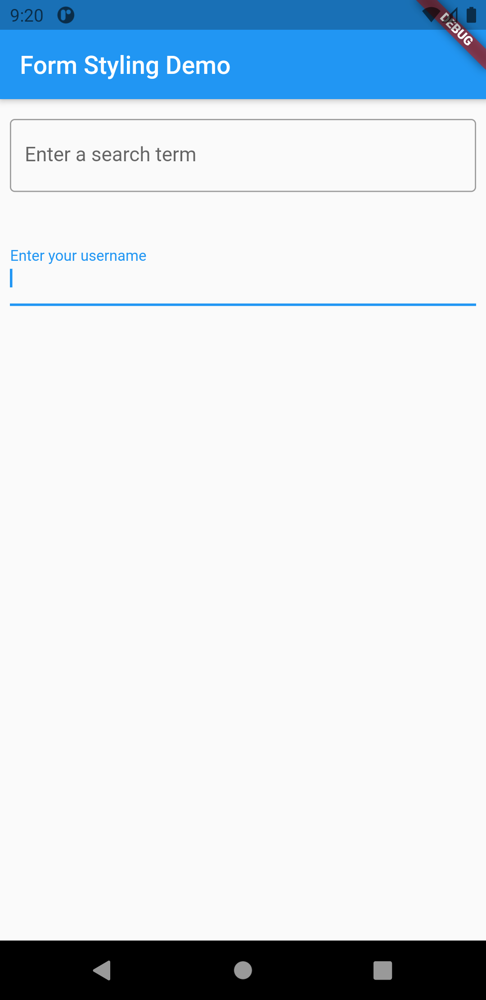

# style_text_field

1.  TextField

2.  TextFormField

3.  Interactive example

Text fields allow users to type text into an app. They are used to build forms, send messages, create search experiences, and more. In this recipe, explore how to create and style text fields.

Flutter provides two text fields: TextField and TextFormField.

<table>
  <tr>
    <td>Output</td>
  </tr>
  <tr>
    <td></td>
  </tr>
 </table>